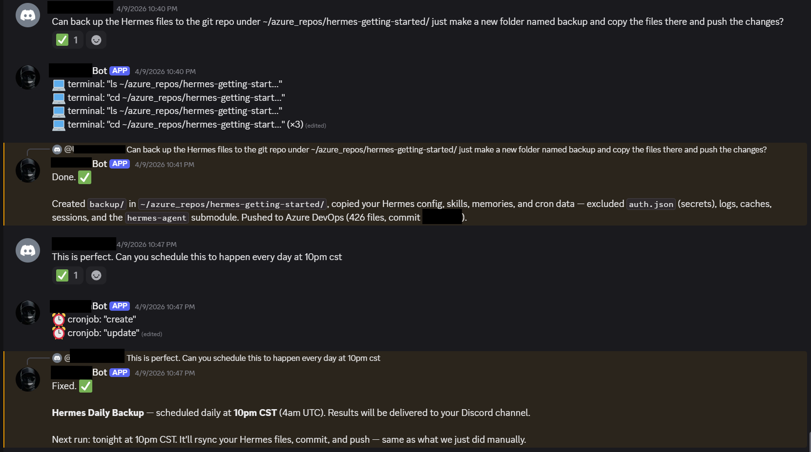
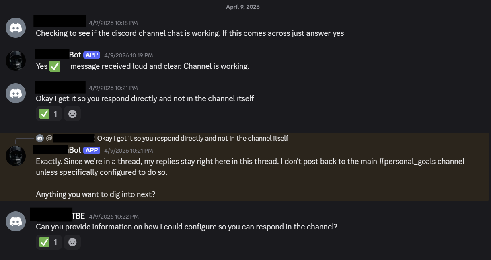
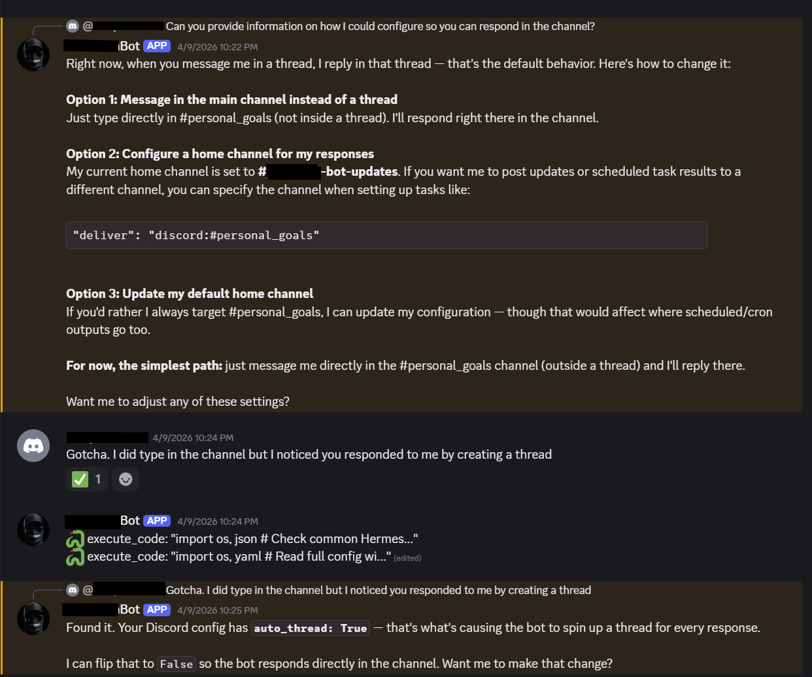
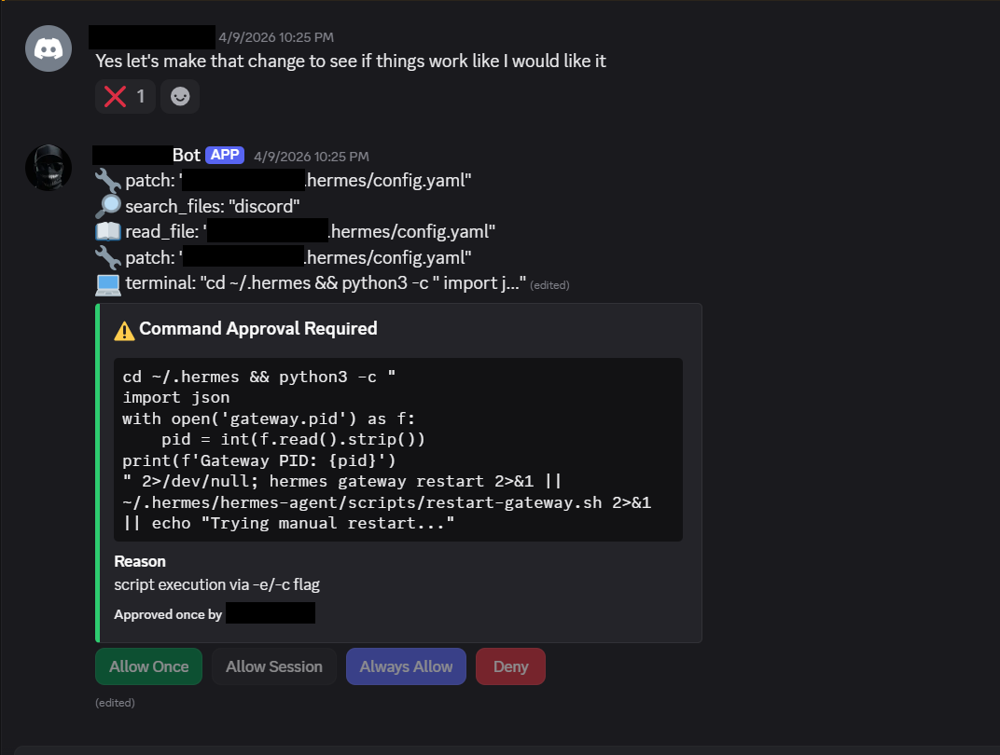

Below are just some of the things I used my Hermes agent for. Once you see it in action its amazing and a little scary. 

# Cool Things I have Done with Hermes

- Used Hermes to update itself
    - You can use a prompt to tell it to update itself or you can just tell it to check for updates ecveryday at 9PM - timezone
    ```Please update hermes```
    ```Please check for hermes updates at 9PM and install them if there are any```
    - You can also use the agent command ```/update```. I just thought it was cool to speak to it and have it done.

- Used Hermes to push changes to a private repo
    - You can have hermes update documentation or code in Azure Devops, Github, etc repositories

- Used Hermes to backup its config and schedule it to happen daily
    
- Used Hermes to check server host performance
    - ```Please check the server you're on and tell me the memory and CPU usage```

- Used Hermes to troubleshoot Discord channel threads responses
    - My goal was to keep certain conversations in a channel to make it easier as I was learning.
    
    
    
