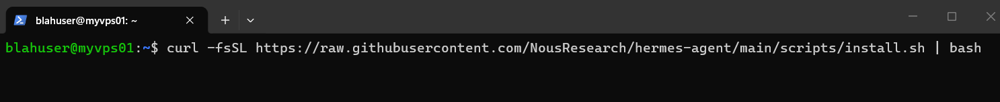
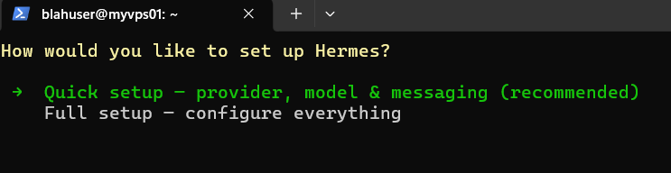
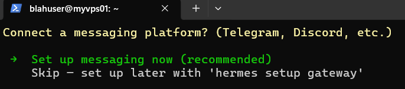
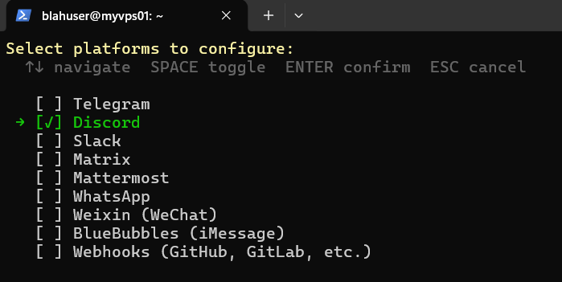
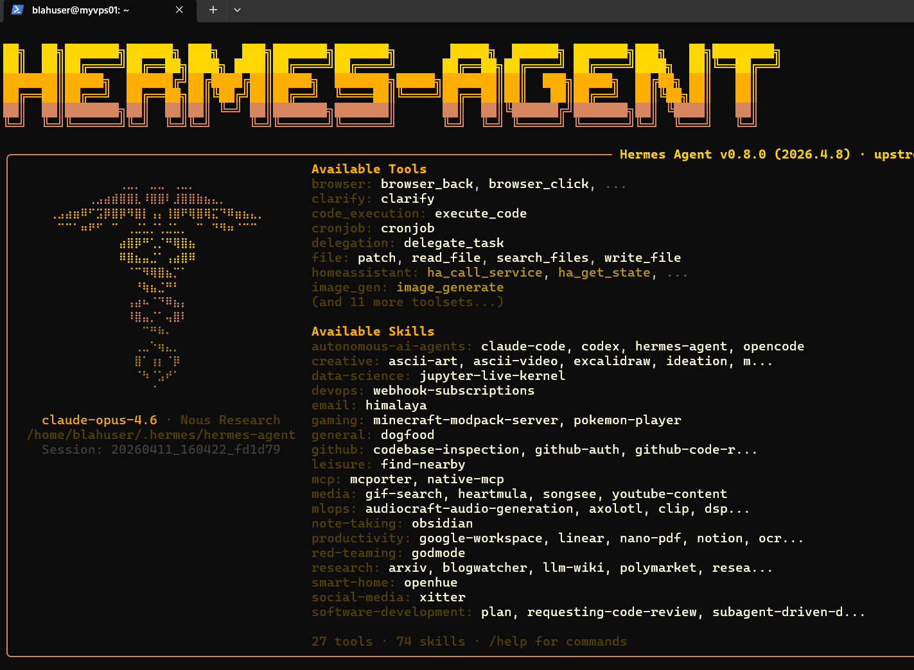
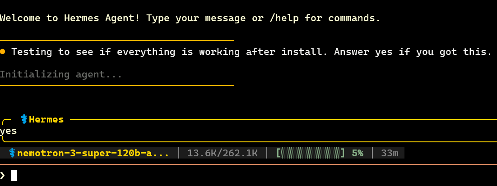

# Hermes Agent Setup

Install and configure Hermes on your VPS with a budget-friendly, security-aware approach.

- Prerequisite: [VPS Setup & Security Guide](/docs/vps-setup/)
- Official docs: <https://hermes-agent.nousresearch.com/docs/>

## Quick context

This guide assumes:

- You already have a secured Ubuntu VPS
- You can SSH into it with your non-root user
- You want to connect Hermes to Discord (other options are supported too)

Messaging options: <https://hermes-agent.nousresearch.com/docs/user-guide/messaging>

## Cost notes

You can keep costs controlled by using free/low-cost model options.

- OpenRouter pay-as-you-go credit: <https://openrouter.ai/>
- ChatGPT pricing: <https://chatgpt.com/pricing>
- Nous provider portal: <https://portal.nousresearch.com/login>

## Prerequisites

- A secured Ubuntu VPS with SSH access
- At least one model provider option:
  - OpenRouter API key (optional)
  - ChatGPT subscription/login (optional)
  - Nous account (optional)
- Discord or Telegram account (optional)

## Step 0: Prepare keys and account info

It is easiest if you collect credentials first:

- [Discord Prep](/docs/discord-prep/)
- [OpenRouter Prep](/docs/openrouter-prep/)

## Step 1: Install Hermes

SSH into your VPS:

```bash
ssh <yourusername>@<your_vps_ip>
```

Use the official install flow from the Hermes site:

- <https://hermes-agent.nousresearch.com/>
- Copy the install command from the site and run it on your VPS



## Step 2: Walk through setup wizard

Hermes updates frequently, so prompts may change slightly. Typical flow:

- Install `ripgrep` / `ffmpeg` dependencies when prompted
- Choose **Quick setup — provider, model & messaging**



- Select provider (you will need API key/login details)
- Connect messaging platform (Discord, Telegram, etc.)



- Select Discord using arrow keys and space, then confirm



- Enter Discord bot token when prompted
- Launch Hermes chat when setup completes



## Step 3: Verify install

```bash
hermes --version
```

Then run a basic test prompt in Hermes chat.



## Helpful links

- GitHub: <https://github.com/NousResearch/hermes-agent>
- Nous Research: <https://nousresearch.com/>
- Reddit:
  - <https://www.reddit.com/r/hermesagent/>
  - <https://www.reddit.com/r/nousresearch/>
