## Cost Estimate

Smallest VPS + free OpenRouter models = **under $10/month** to run your own AI agent.

---

# Setting Up and Securing an Ubuntu VPS

This guide walks through a practical, security-first VPS setup for running Hermes. The screenshots use Raff Technologies, but the Linux hardening steps work on most VPS providers.

## Scope and audience

- Geared toward Windows users (PowerShell + optional WSL)
- Focused on learning by doing, not one-click deployment
- Keeps costs low while following core security practices

## Conventions used in this guide

- `<your_vps_ip>` = the server public IP from your VPS dashboard
- `<yourusername>` = your non-root Linux user
- Commands without `sudo` in early steps are run as `root`
- Commands with `sudo` are run as your non-root user

## Prerequisites

- Windows 11 (built-in SSH client, or WSL2)
- A VPS provider account (example shown: Raff Technologies)
  - Alternatives: DigitalOcean, Linode, Vultr, Hetzner, etc.
- An SSH key pair

## Step 1: Generate SSH key

Open PowerShell and run:

```bash
ssh-keygen -t ed25519
```

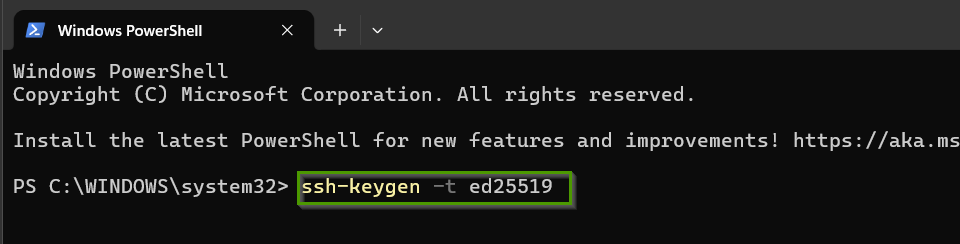

- You will be prompted for a passphrase.
  - A passphrase improves security.
  - If blank, anyone with local access to your machine can use the private key.

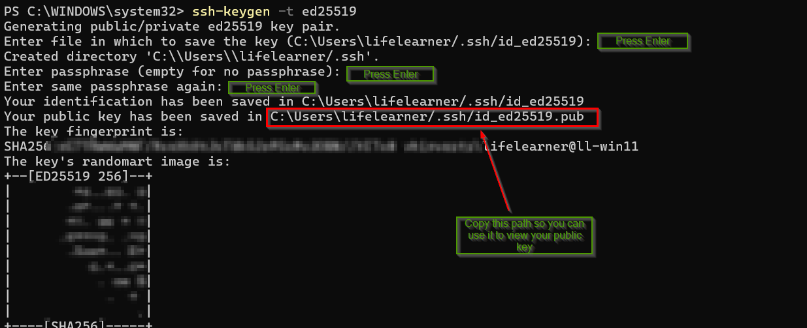

View your public key:

```bash
cat ~/.ssh/id_ed25519.pub
```

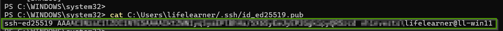

Key files created:

- `id_ed25519` (private key) — **never share**
- `id_ed25519.pub` (public key) — safe to upload to your VPS provider

## Step 2: Deploy your VPS

Provider-specific example (Raff): <https://rafftechnologies.com/>. You can follow equivalent steps in any provider UI.

- Sign up and enable MFA (recommended)
- Click **+ Create** → **Create Instance**

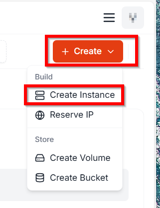

Recommended selections:

- Region: closest to you
- OS Template: **Ubuntu 24.04 x64**

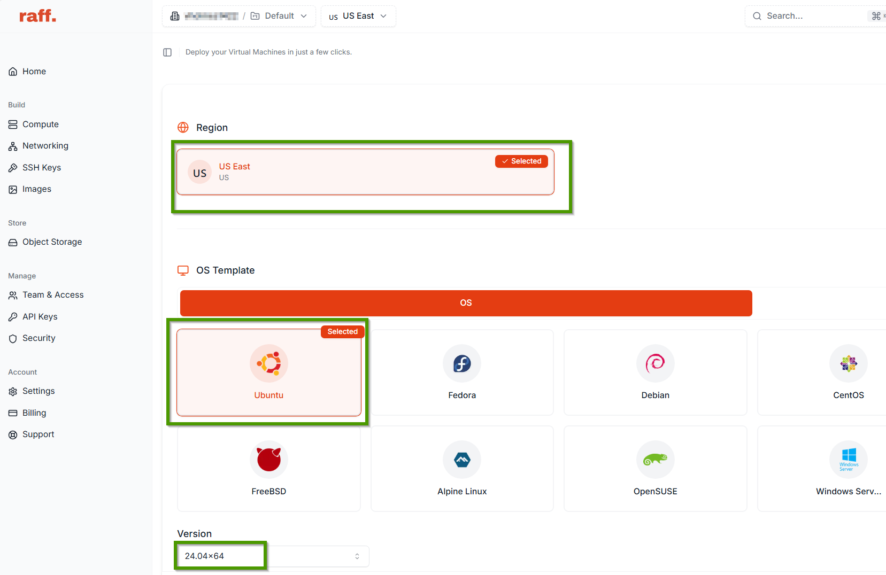

- Size: pick based on budget (smallest plan is fine for learning/Hermes)

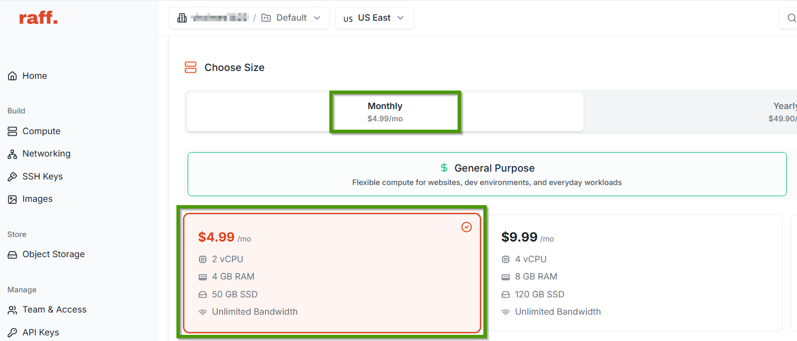

- Networking:
  - Private Network: Auto (recommended)
  - Public IPv4: Auto-random
  - IPv6: optional

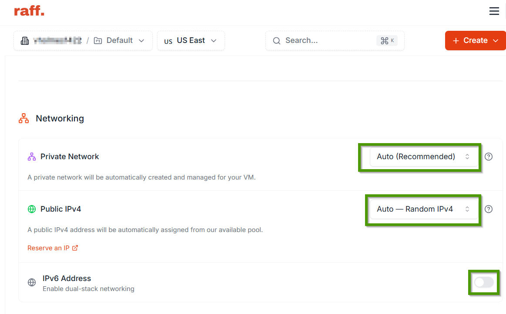

Authentication:

- Add your SSH public key
- Select that key for the new VM

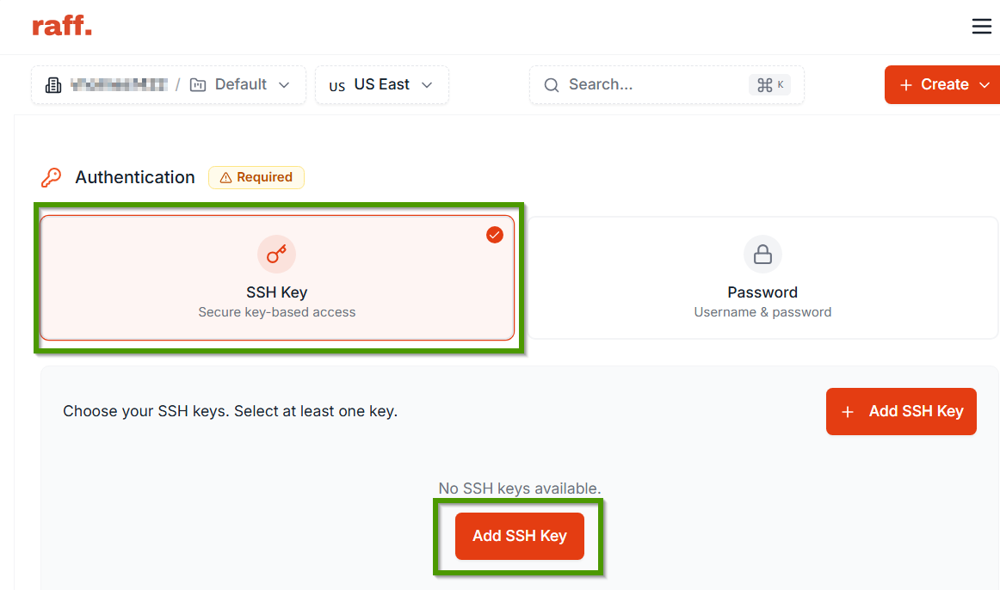
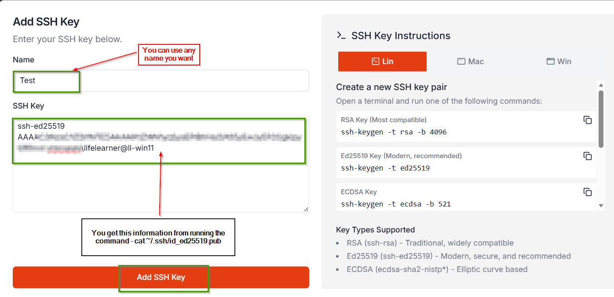
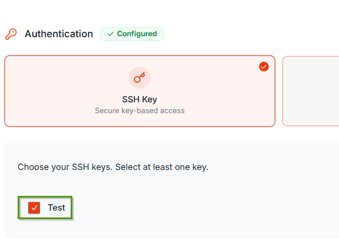

Set hostname and deploy:

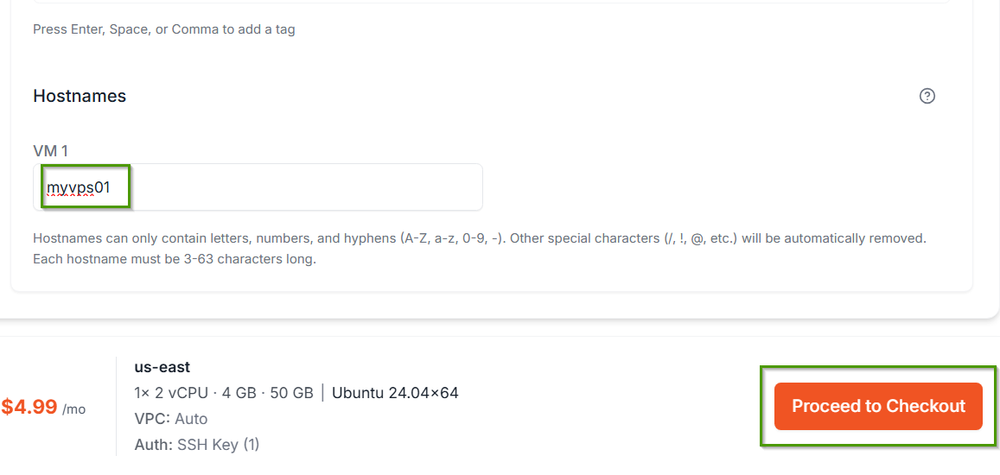

- Click **Proceed to Checkout**
- Wait for the VPS to be created

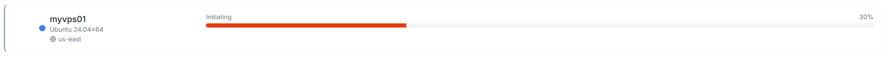

- Record the public IP from the dashboard

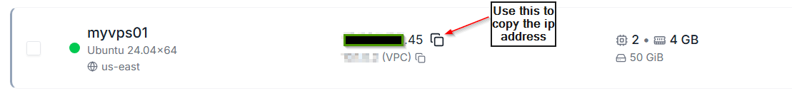

## Step 3: Initial server setup

SSH into your VPS as root from PowerShell:

```bash
ssh root@<your_vps_ip>
```

If needed, specify your key explicitly:

```bash
ssh -i ~/.ssh/id_ed25519 root@<your_vps_ip>
```

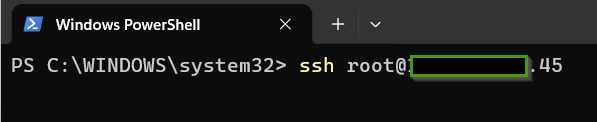
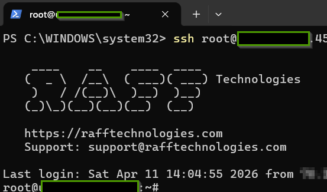

Update packages:

```bash
apt update && apt upgrade -y
```

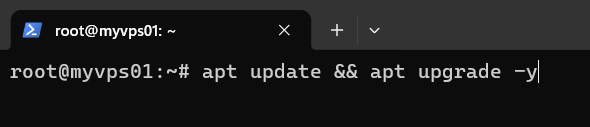

Install essentials:

```bash
apt install -y vim curl wget git ufw fail2ban
```

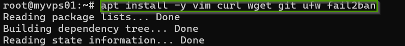

## Step 4: Create a non-root user

```bash
adduser <yourusername>
usermod -aG sudo <yourusername>
cp -r ~/.ssh /home/<yourusername>/
chown -R <yourusername>:<yourusername> /home/<yourusername>/.ssh
chmod 700 /home/<yourusername>/.ssh
chmod 600 /home/<yourusername>/.ssh/authorized_keys
```

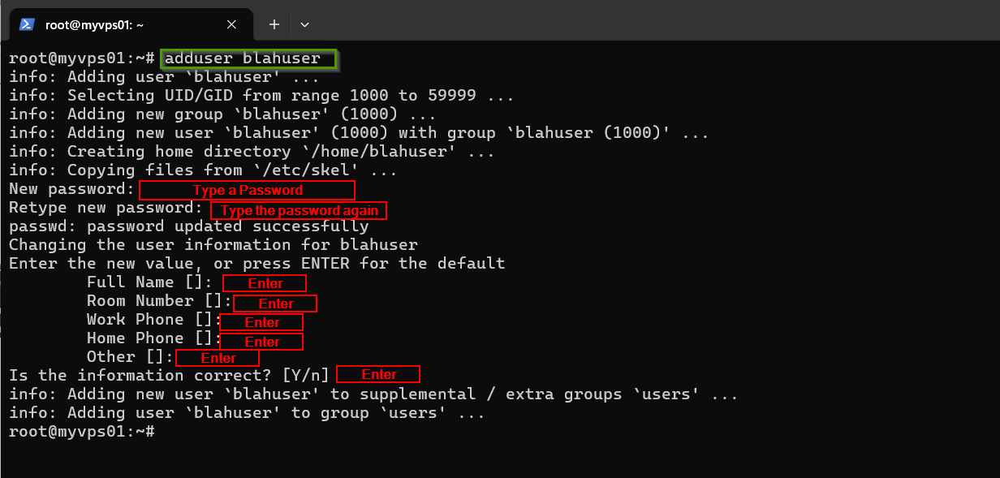
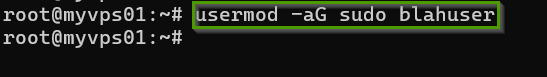
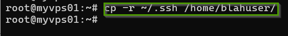
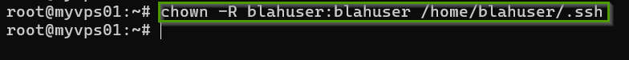
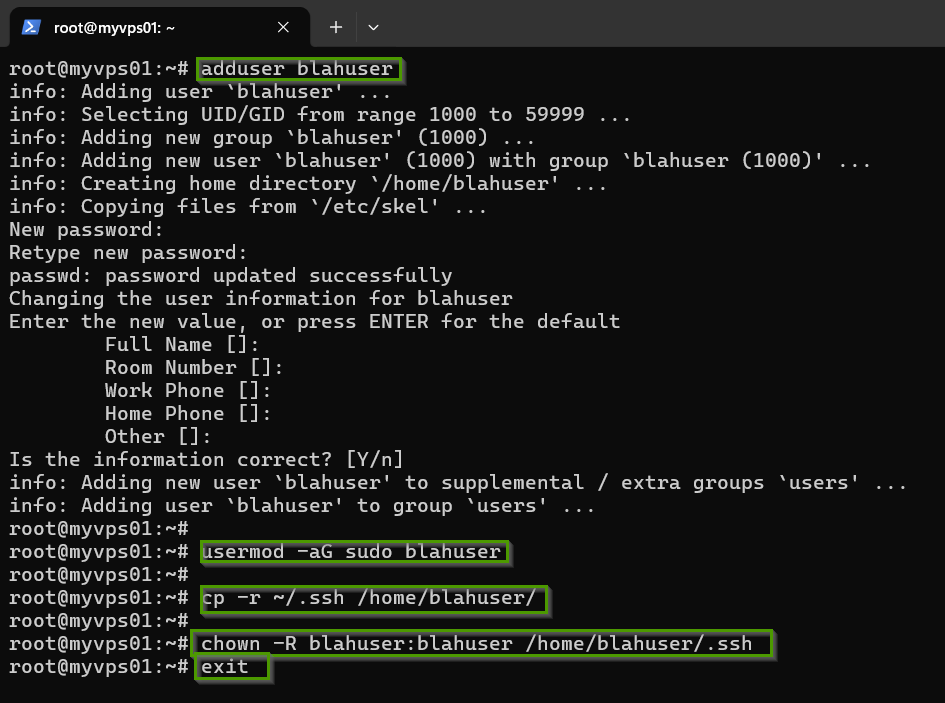

Test non-root login in a **new terminal**:

```bash
ssh <yourusername>@<your_vps_ip>
```

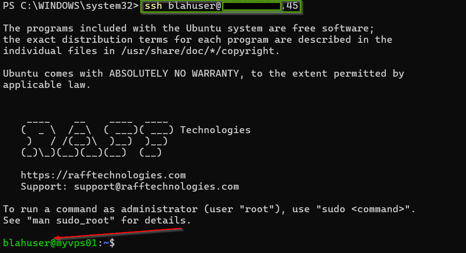

✅ Continue only after this works.

## Step 5: Harden SSH (lockout-safe sequence)

> **Important:** Keep your current session open. Open a second terminal and verify non-root login works before reloading SSH.

Edit SSH config:

```bash
sudo nano /etc/ssh/sshd_config
```

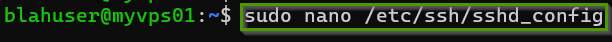

Set:

```text
PermitRootLogin no
PasswordAuthentication no
```

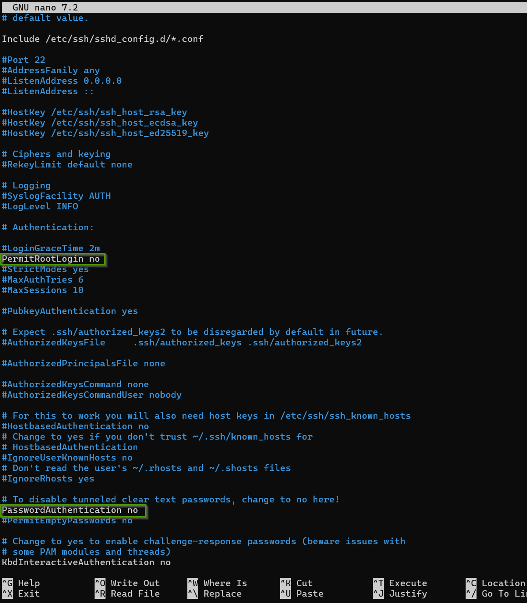

Save and exit nano:

- `Ctrl + O`, Enter
- `Ctrl + X`

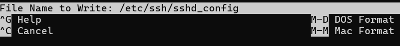
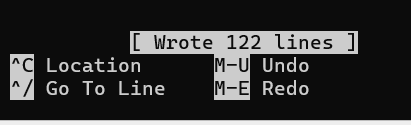

Validate and reload:

```bash
sudo sshd -t
sudo systemctl reload ssh
sudo systemctl status ssh
```

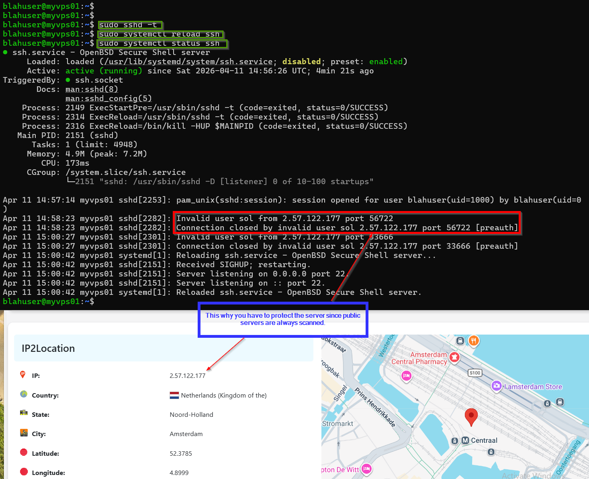

Validation checkpoint:

- `sshd -t` returns no errors
- SSH service is active
- You can still log in as `<yourusername>`

## Step 6: Configure firewall (UFW)

Run in this order:

```bash
sudo ufw default deny incoming
sudo ufw default allow outgoing
sudo ufw allow 22/tcp
sudo ufw enable
sudo ufw status verbose
```

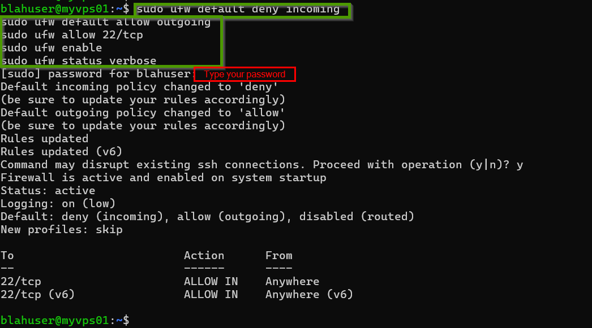

Validation checkpoint:

- UFW status is `active`
- `22/tcp` is allowed

> Later, if you host web apps, also allow `80/tcp` and `443/tcp`.

## Step 7: Enable Fail2Ban

```bash
sudo systemctl enable --now fail2ban
sudo systemctl status fail2ban
sudo fail2ban-client status sshd
```

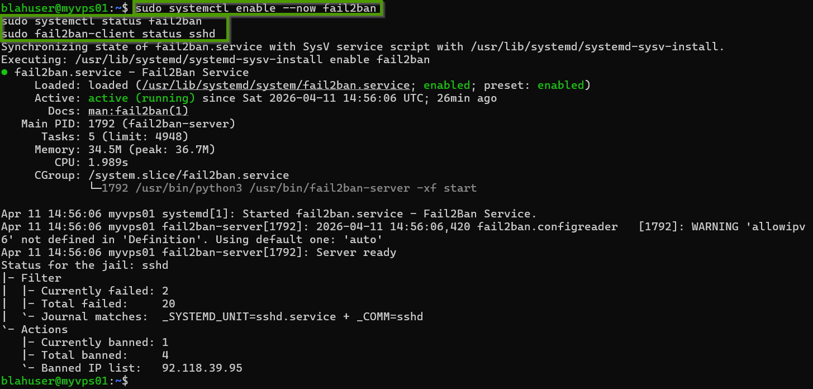

Validation checkpoint:

- Fail2Ban service is active
- `sshd` jail is listed

## Step 8: Security checklist complete

- [x] Non-root SSH login works
- [x] Root SSH login disabled
- [x] Password authentication disabled
- [x] UFW firewall active
- [x] Fail2Ban running

## Step 9: Explore next steps

- Ideas: [Hermes Agent Ideas](/docs/hermes-ideas/)
- Next setup guide: [Hermes Agent Setup](/docs/hermes-setup/)

## Maintenance

Run updates weekly:

```bash
sudo apt update && sudo apt upgrade -y
```

You can also ask Hermes to schedule this as a recurring maintenance task.

---
